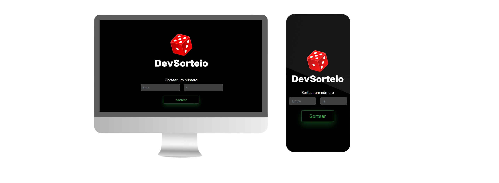
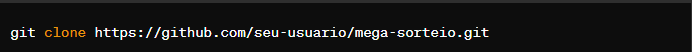

<h1 align="center" style="font-weight: bold;">Dev-Sorteio 💻</h1>

 

 <a href="#tech">Tecnologias</a> • 
 <a href="#started">Começando</a> • 
  •

     <a href="https://hcinfo9.github.io/Dev-Sorteio/">📱 Visite este Projeto</a>

<h2 id="layout">🎨 Layout:</h2>

    

<h2 id="tech">💻 Tecnologias:</h2>
  <ul>
      <li></li>
      <li></li>
      <li></li>
      <li></li>
      
  </ul>
<h2 id="started">🚀 Descrição:</h2> 

Dev Sorteio é uma aplicação web simples desenvolvida para sortear números aleatórios dentro de um intervalo especificado pelo usuário. A aplicação é construída utilizando HTML, CSS e JavaScript, com o auxílio do framework Bootstrap para estilização  

<h3>Pre-Requisitos:</h3> 

Um navegador web moderno, como Google Chrome, Mozilla Firefox, Safari, ou Microsoft Edge.
Conexão com a internet para carregar recursos externos, como o framework Bootstrap.  

<h3>Executando o Projeto:</h3>

Para executar a aplicação localmente, siga estas etapas:

<ul>
  <li>Clone o repositório para o seu ambiente de desenvolvimento:  
      
</li>
  <li>Abra o arquivo index.html em seu navegador web preferido.</li>
  <li>Insira o valor mínimo e máximo para o sorteio nos campos correspondentes.</li>
  <li>Abra o arquivo index.html em seu navegador web preferido.</li>
  <li>Clique no botão "Sortear" para iniciar o sorteio.</li>
  <li>Outra forma de acessar o projeto é clicando em "Visite este Projeto" no começo na pagina</li>
</ul>  

<h2 id="colab">🤝 Colaboradores:</h2>

Um obrigado especial aos colaboradores do Projeto.

<table>
  <tr>
    <td align="center">
      <a href="#">
         
        
          <b>Henrique Donato</b>
        
      </a>
    </td>
</table>
